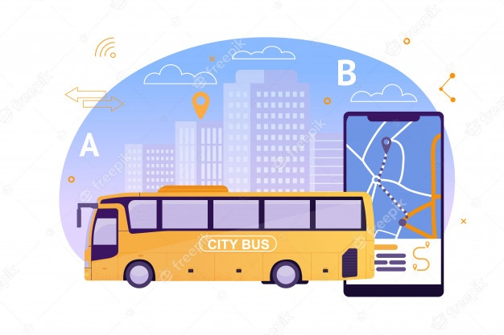

# real-time-bustracking

This project displays a map and tracks the real time bus route between MIT and Harvard. We can choose different styles of map display as well.

**What I Learned**
- How to use mapbox APIs.
- Rendering a map and placing a marker in particular location on the map.
- Using setTimeout() for continuous movement of the marker on the bus route
- Using different styles of map display
- Adding a highlighter line between distinations along the route.

**bus route**

## Description

- It gives the real time bus route between MIT and harvard. The bus route is highlighted and distination markers are placed. We can change the style of the map display using the button selectors.

## Installation

- Download this project in your working directory through, \
git clone https://github.com/vanisbala/real-time-bustracking
- Open real-time-bustracking project in VScode, go to index.html, right click and select 'open in default browser'.
- The project output will open in your browser.
- Click on 'Show stops between MIT and Harvard' 
- The Marker on MIT will start to move along the bus route stopping in each bus stop till it reaches Harvard Bus stop.
- The bus route is highlighted.
- Also, you can click on 'satellite/ dark/ street/ outdoor' buttons to select the corresponding map display style.

### 

## Built with

- [HTML](https://developer.mozilla.org/en-US/docs/Web/HTML)
- [CSS](https://developer.mozilla.org/en-US/docs/Web/CSS)
- [JavaScript](https://developer.mozilla.org/en-US/docs/Web/Javascript)

## Deployed Link

- [See live Site](https://vanisbala.github.io/real-time-bustracking/)

## Roadmap

- Getting the start and end location from the user and display the highlighted route.

## Support

-  [Link to Github](https://github.com/vanisbala)

## License

- [MIT License](https://github.com/vanisbala/real-time-bustracking/blob/profilepro/LICENSE)

## Credits

Thanks to MITxPRO for giving me the opportunity to work on this project. 

The wonderful MIT professors who always gives simple, easy to understand explanations for any complex topic,
- Abel Sanchez
- John Williams  

My gratitudes to our learning facilitators, for their guidance throughout the project.
- Carolina Barreiro
- Greg Lindeman
- Puneet Saraswat